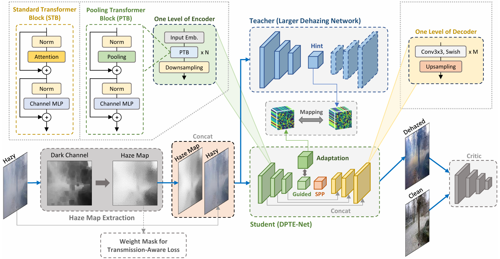

# DPTE-Net: Distilled Pooling Transformer Encoder for Efficient Realistic Image Dehazing

[](https://huggingface.co/tranleanh/dpte-net)
[](https://arxiv.org/abs/2412.14220)

The official implementation of the paper "Distilled Pooling Transformer Encoder for Efficient Realistic Image Dehazing".

Authors: [Le-Anh Tran](https://scholar.google.com/citations?user=WzcUE5YAAAAJ&hl=en), [Dong-Chul Park](https://scholar.google.com/citations?user=VZUH4sUAAAAJ&hl=en)

Journal: [Neural Computing and Applications](https://link.springer.com/journal/521) (Springer)

## Introduction

#### Framework diagram

<p align="center">

</p>

## Test

- Create environment & install required packages
```
conda create -n dpteenv python=3.7
conda activate dpteenv
bash install_core_env.sh
```
- Download pre-trained weights from [Hugging Face](https://huggingface.co/tranleanh/dpte-net)
- Prepare test data
- Run test
```
python dehaze.py
```
- Evaluate PSNR & SSIM
```
python eval_psnr_ssim.py
```

## Train

- Create environment & install required packages
- Prepare dataset (a parent directory containing two sub-folders 'A' and 'B' like below):

```bashrc
.../path/to/data
            | A (containing hazy images)
            | B (containing clean images)
*** Note: a pair of hazy-clean images must have the same name
```
- Configure training parameters in [train.py](https://github.com/tranleanh/dpte-net/blob/main/train.py#L147)
- Train command
```
python train.py
```

## Citation

(will be updated)

LA Tran
